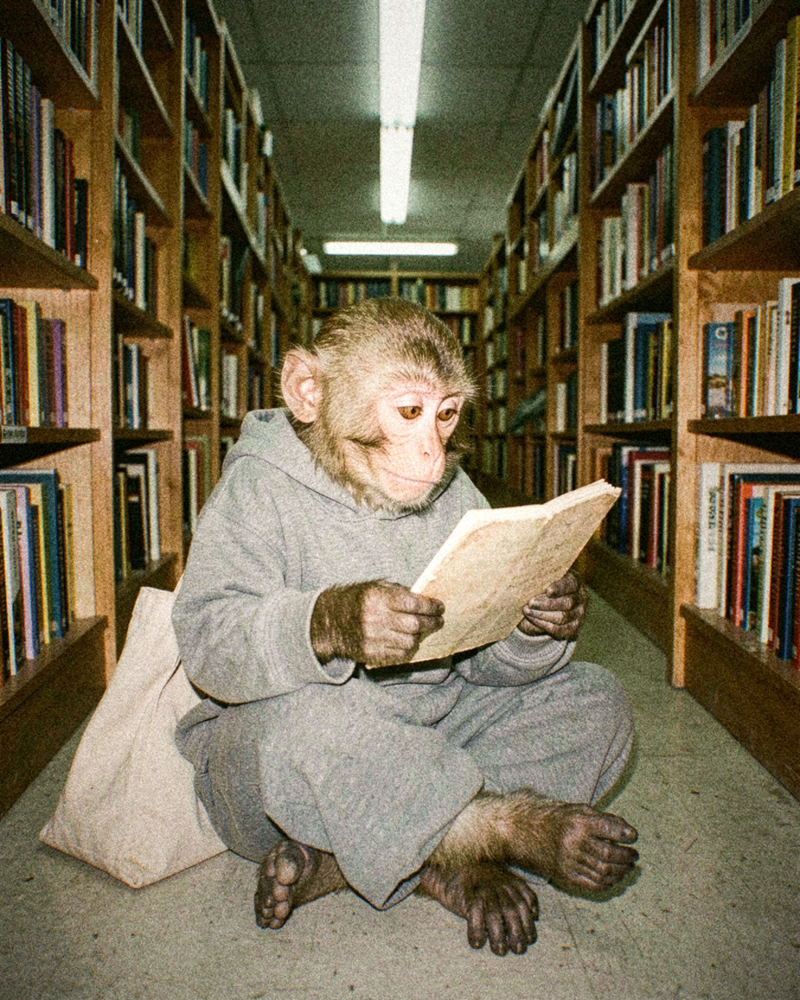

# Tanda 20261004-2213-c25d

Formato: **feed** · Escena: — · Tema: —

## 20261004-2213-c25d-01 — discarded
**Idea:** Macaco trabajando en una MacBook en un café porteño, con un cortado a medio tomar al lado, plano abierto  
**Look:** `35mm_kodak_portra` · Buenos Aires café · sitting · soft window light  
**Descartada:** no pasó el QC en 3 intento(s)

## 20261004-2213-c25d-02 — draft
  
**Idea:** Macaco sentado en el piso de un pasillo de librería, absorto en un libro de bolsillo, retrato cercano  
**Look:** `point_and_shoot_flash` · bookstore · sitting on the floor · fluorescent interior  
**QC:** 8.0 — Parece el mismo macaco joven: pelaje marrón oliva, hocico corto, ojos ámbar redondos y orejas pequeñas pegadas a la cabeza.; La cara es algo más rosada y lisa que en las referencias, con menos arrugas finas. Es una diferencia leve de identidad.; Las manos son oscuras y de dedos largos, y las piernas están cruzadas con coherencia. Los pies son oscuros y están bien formados. No hay miembros extra ni fusionados.  
**Caption:** Pasillo C, sección usados. Ya no estoy en la librería, estoy en el capítulo 12.  
**Hashtags:** #buenosaires #librerias #35mm #streetphotography  

## 20261004-2213-c25d-03 — discarded
**Idea:** Macaco esperando en un konbini de Tokio de noche con un café helado, visto de espaldas  
**Look:** `35mm_cinestill_800t` · Tokyo konbini · seen from behind · neon night  
**Descartada:** no pasó el QC en 3 intento(s)

---
Para descartar una pieza: borrá su .jpg en este PR antes de mergear. Mergear = aprobar; las piezas restantes entran a la cola de publicación.