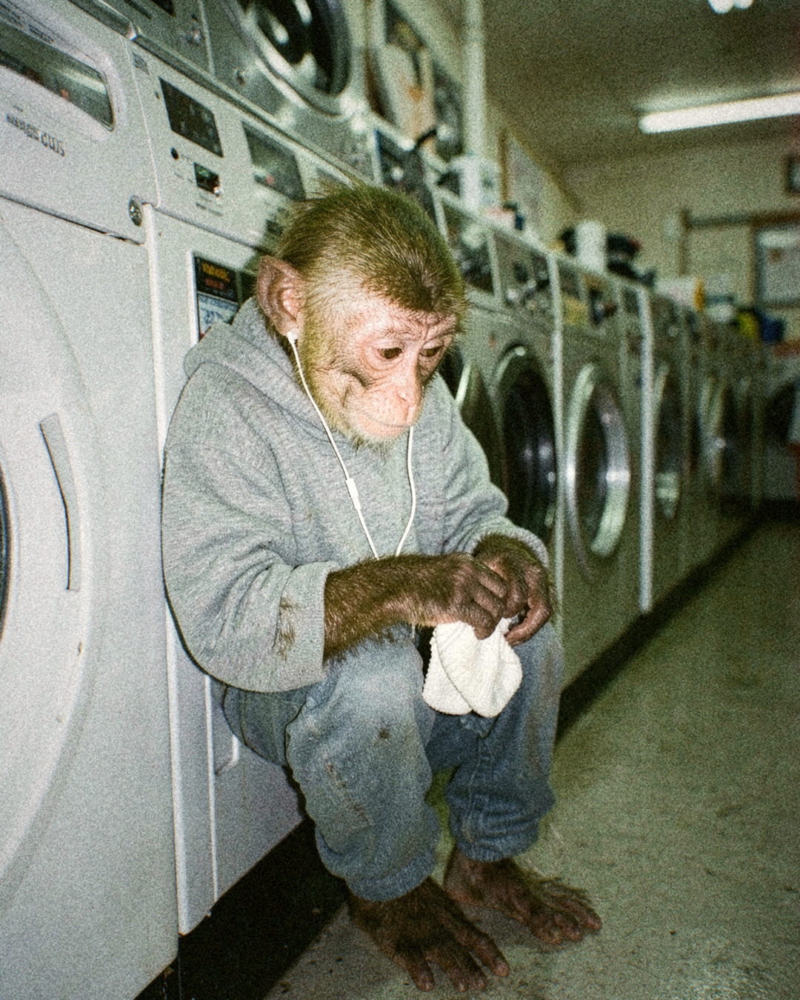

# Tanda 20261006-1507-b3cc

Formato: **feed** · Escena: — · Tema: —

## 20261006-1507-b3cc-01 — discarded
**Idea:** Macaco regando las plantas del balcón en pijama al atardecer, con el mate al lado  
**Look:** `35mm_kodak_portra` · Buenos Aires balcony · standing · golden hour  
**Descartada:** no pasó el QC en 3 intento(s)

## 20261006-1507-b3cc-02 — draft
  
**Idea:** Macaco doblando ropa en una lavandería con las secadoras girando de fondo  
**Look:** `point_and_shoot_flash` · laundromat · leaning against something · fluorescent interior  
**QC:** 8.0 — Es un macaco joven con cara rosada y arrugada, hocico corto, ojos ámbar, orejas pequeñas pegadas a la cabeza y manos oscuras de dedos largos. Coincide bien con las referencias.; El pelaje de la cabeza tiene un tono más verdoso y dorado que el marrón de las referencias, y el cuerpo se ve algo más infantil. Por eso el parecido de identidad no es total.; El lugar, la luz fluorescente, el buzo gris grande, los auriculares con cable y la mirada hacia las manos mientras dobla una media coinciden con la idea.  
**Caption:** Medias de tubo. Un solo par, tres ciclos de secado.
El resto de la ropa sigue girando.  
**Hashtags:** #buenosaires #lavadero #streetphotography #flashphotography  

## 20261006-1507-b3cc-03 — discarded
**Idea:** Macaco sentado en el piso de una librería leyendo un libro, plano abierto donde se ve chico  
**Look:** `iphone_night` · bookstore · sitting on the floor with legs out of frame · tungsten practicals  
**Descartada:** no pasó el QC en 3 intento(s)

## 20261006-1507-b3cc-04 — discarded
**Idea:** Retrato cercano del macaco comiendo un alfajor frente a un kiosco de noche  
**Look:** `35mm_cinestill_800t` · kiosco · profile · neon night  
**Descartada:** no pasó el QC en 3 intento(s)

---
Para descartar una pieza: borrá su .jpg en este PR antes de mergear. Mergear = aprobar; las piezas restantes entran a la cola de publicación.