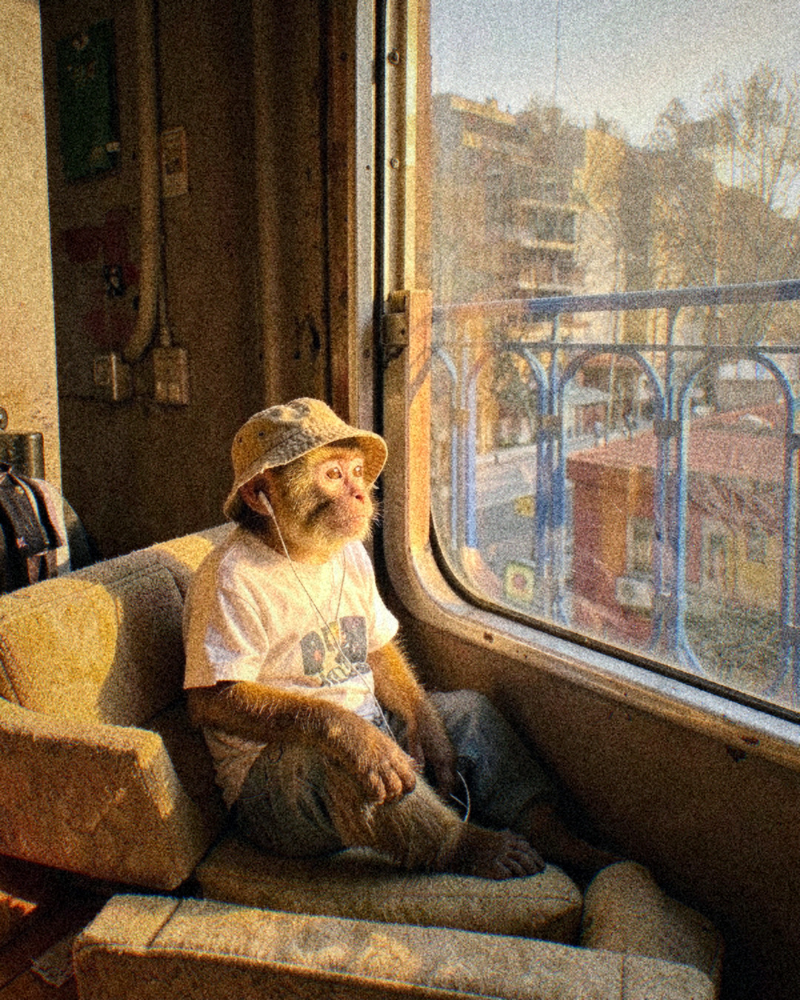
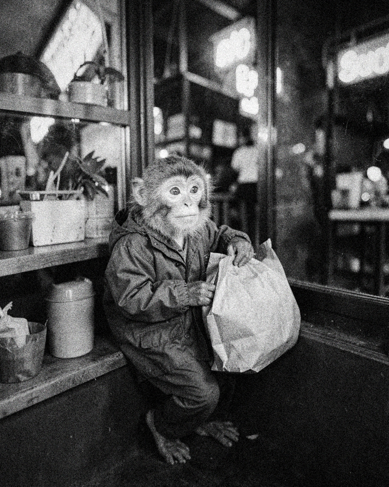

# Tanda 20261006-1639-4e15

Formato: **feed** · Escena: — · Tema: —

## 20261006-1639-4e15-01 — discarded
**Idea:** Trabajando en una MacBook en un café, con un cortado a medio tomar  
**Look:** `35mm_kodak_portra` · Buenos Aires café · at a table · soft window light  
**Descartada:** no pasó el QC en 3 intento(s)

## 20261006-1639-4e15-02 — discarded
**Idea:** Leyendo el diario sentado en un cajón de leche en una esquina de Manhattan  
**Look:** `compacta_digital_2005` · Manhattan street corner · on a stool · hard midday sun  
**Descartada:** no pasó el QC en 3 intento(s)

## 20261006-1639-4e15-03 — discarded
**Idea:** Tirado en el piso del living en una videollamada, con la laptop sobre la panza  
**Look:** `iphone_night` · apartment living room · reclining on a sofa · tungsten practicals  
**Descartada:** no pasó el QC en 3 intento(s)

## 20261006-1639-4e15-04 — discarded
**Idea:** Probándose un traje dos talles más grande frente al espejo de un local  
**Look:** `point_and_shoot_flash` · barbershop · seen through a mirror · fluorescent interior  
**Descartada:** no pasó el QC en 3 intento(s)

## 20261006-1639-4e15-05 — discarded
**Idea:** Hojeando discos de vinilo en una disquería llena  
**Look:** `35mm_cinestill_800t` · record store · standing in line · mixed light  
**Descartada:** no pasó el QC en 3 intento(s)

## 20261006-1639-4e15-06 — discarded
**Idea:** Sentado en el piso de un pasillo de librería, metido en un libro  
**Look:** `medio_formato_luz_ventana` · bookstore · sitting with lower body partly hidden · tungsten practicals  
**Descartada:** no pasó el QC en 3 intento(s)

## 20261006-1639-4e15-07 — draft
  
**Idea:** Viajando en colectivo junto a la ventanilla, con auriculares  
**Look:** `disposable_camera` · colectivo seat · looking out a window · golden hour  
**QC:** 7.0 — Es un macaco joven con la cara rosada y arrugada, el hocico corto, los ojos redondos ámbar y las orejas pequeñas, coherente con las referencias.; El pelaje es más dorado y anaranjado que el marrón cálido de las referencias. Es una diferencia leve de tono.; Lleva sombrero de pescador, remera y auriculares con cable, y mira por la ventana con luz de hora dorada. Coincide bien con la idea.  
**Caption:** Línea 60, ventanilla, auriculares. La ciudad pasa y yo no me bajo.  
**Hashtags:** #buenosaires #colectivo #35mm #streetphotography  

## 20261006-1639-4e15-08 — draft
  
**Idea:** Comprando un alfajor en un kiosco de noche  
**Look:** `bw_tri_x` · kiosco · leaning against something · neon night  
**QC:** 7.0 — Es un macaco de cara rosada pálida, hocico corto, ojos ámbar redondos y orejas pequeñas. Coincide bastante con las referencias, aunque la cara es algo más lisa y juvenil, con menos arrugas.; Al ser blanco y negro (Tri-X, como pide la idea) no se puede juzgar el color del pelaje. Se ve gris claro, pero eso es esperable en B&W.; Hay campera tipo impermeable con capucha, bolsa de papel marrón, apoyo contra el mostrador/estante y carteles de neón desenfocados. Coincide con el kiosco nocturno.  
**Caption:** Después de las once el kiosco es el único lugar abierto que me entiende.
Alfajor triple y a casa.  
**Hashtags:** #buenosaires #kiosco #streetphotography #trix400  

---
Para descartar una pieza: borrá su .jpg en este PR antes de mergear. Mergear = aprobar; las piezas restantes entran a la cola de publicación.