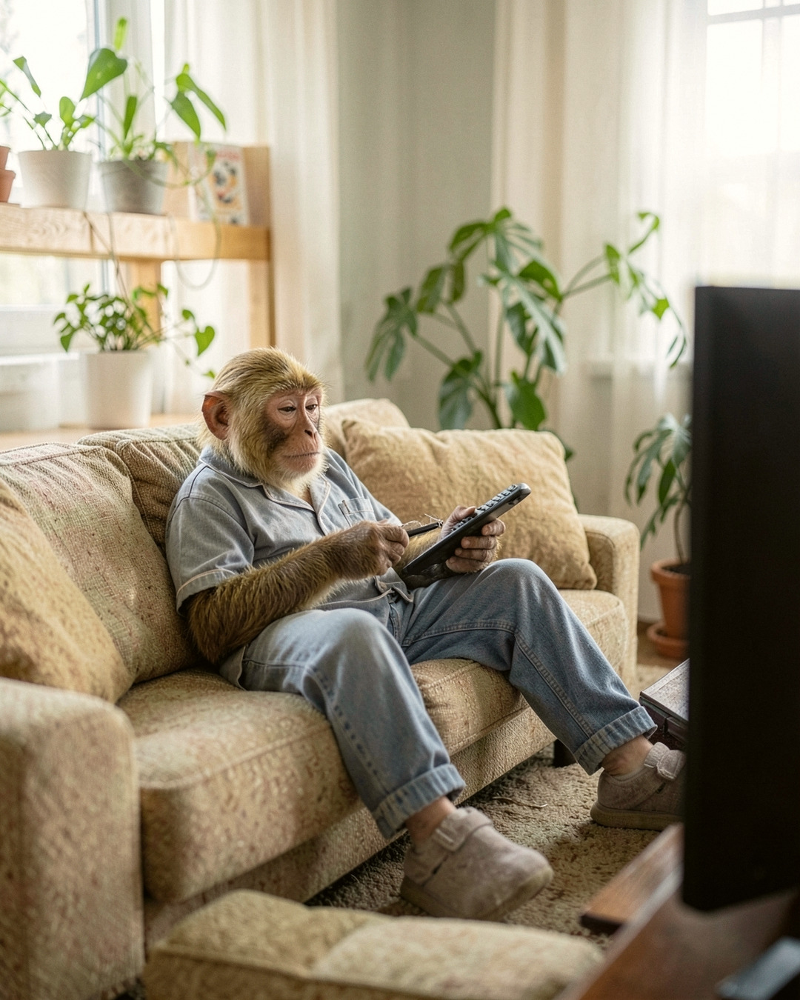

# Tanda 20261006-1737-77cc

Formato: **feed** · Escena: — · Tema: —

## 20261006-1737-77cc-01 — discarded
**Idea:** Regando las plantas del balcón por la mañana  
**Look:** `iphone_daylight` · Buenos Aires balcony · standing · bright morning sun  
**Descartada:** no pasó el QC en 3 intento(s)

## 20261006-1737-77cc-02 — discarded
**Idea:** Trabajando con la laptop en un café junto a la ventana  
**Look:** `window_light_interior` · Buenos Aires café · at a table · soft window light  
**Descartada:** no pasó el QC en 3 intento(s)

## 20261006-1737-77cc-03 — discarded
**Idea:** Eligiendo tomates en la verdulería  
**Look:** `street_overcast` · neighborhood verdulería · standing · overcast daylight  
**Descartada:** no pasó el QC en 3 intento(s)

## 20261006-1737-77cc-04 — discarded
**Idea:** Tomando mate en un banco de plaza al atardecer  
**Look:** `iphone_golden_hour` · plaza bench · sitting on a bench · late afternoon sun  
**Descartada:** no pasó el QC en 3 intento(s)

## 20261006-1737-77cc-05 — discarded
**Idea:** Mirando discos de vinilo en una disquería luminosa  
**Look:** `mirrorless_35mm` · record store · leaning against something · warm interior daylight  
**Descartada:** no pasó el QC en 3 intento(s)

## 20261006-1737-77cc-06 — discarded
**Idea:** Viaje en colectivo con sueño  
**Look:** `iphone_daylight` · colectivo seat · sitting · overcast daylight  
**Descartada:** no pasó el QC en 3 intento(s)

## 20261006-1737-77cc-07 — discarded
**Idea:** Leyendo un libro en el pasillo de una librería  
**Look:** `mirrorless_35mm` · bookstore · standing · warm interior daylight  
**Descartada:** no pasó el QC en 3 intento(s)

## 20261006-1737-77cc-08 — draft
  
**Idea:** Tele en el sillón a la tarde  
**Look:** `window_light_interior` · apartment living room · reclining on a sofa · soft window light  
**QC:** 7.0 — Es un macaco adulto, no un chimpancé ni un peluche. La escena es clara y cotidiana: reclinado en un sillón, con control remoto, ventana, plantas y almohadones.; La identidad coincide solo en parte. El pelaje de la cabeza es amarillo dorado, más claro que el marrón de las referencias. Las orejas son más rosadas y prominentes, y la cara es algo más rosada y lisa que la de las referencias, con menos arrugas.; Coincide bien con la idea: living luminoso, luz suave de ventana, pose reclinada, encuadre medio amplio y pantuflas. La TV queda fuera de cuadro, solo se ve su borde. La ropa es un pijama celeste y un pantalón que parece jean, un desvío menor.  
**Caption:** Tarde de sillón. Control en mano, cero planes.  
**Hashtags:** #buenosaires #livingroom #windowlight #35mm  

---
Para descartar una pieza: borrá su .jpg en este PR antes de mergear. Mergear = aprobar; las piezas restantes entran a la cola de publicación.