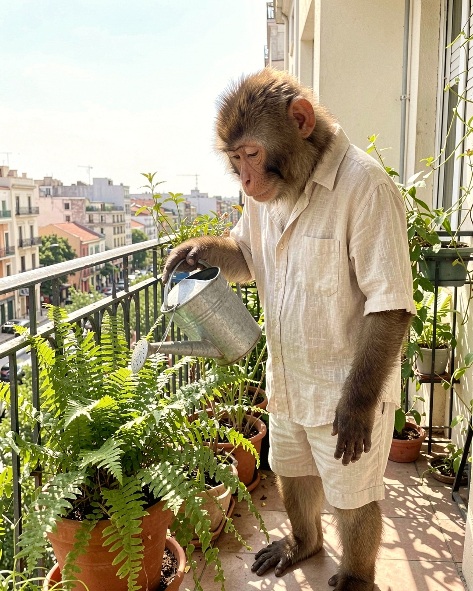
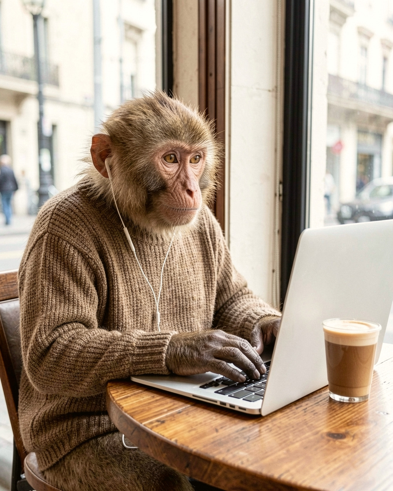
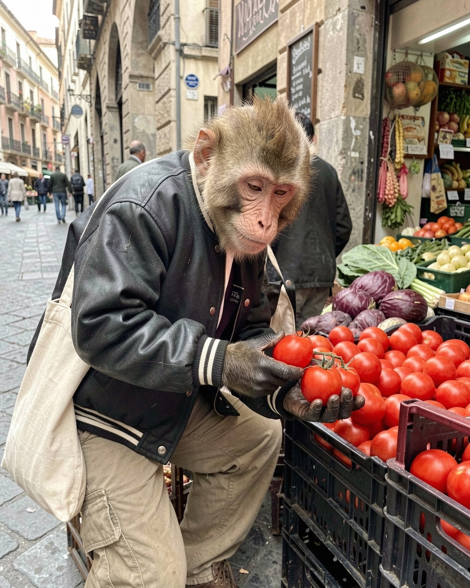

# Tanda 20261006-1830-fcf7

Formato: **feed** · Escena: — · Tema: —

## 20261006-1830-fcf7-01 — draft
  
**Idea:** Regando las plantas del balcón con el sol de la mañana  
**Look:** `iphone_daylight` · Buenos Aires balcony · standing · bright morning sun  
**QC:** 7.0 — Es un macaco adulto, parado como una persona, con camisa de lino y short que le quedan bien. Es coherente con las referencias.; La cara es más rosada/anaranjada y las orejas son rosas. Las referencias muestran una cara marrón tostado con piel más oscura alrededor de los ojos, así que la identidad no es del todo fiel.; El pelaje es marrón cálido, sin tono verdoso ni gris. Tiene una barba clara en el mentón que no se ve en las referencias.  
**Caption:** Siete y media y los helechos ya me deben plata.  
**Hashtags:** #buenosaires #balcon #plantas  

## 20261006-1830-fcf7-02 — draft
  
**Idea:** Trabajando con la laptop en un café junto al ventanal  
**Look:** `window_light_interior` · Buenos Aires café · at a table · soft window light  
**QC:** 7.0 — Es un macaco adulto con pelaje marrón cálido y manos oscuras de dedos largos, como en las referencias.; La cara y las orejas son bastante más rosadas/rojizas que en las referencias, que tienen una cara tan-marrón con piel oscura alrededor de los ojos.; Tiene los ojos ámbar bien abiertos, no entrecerrados y calmos como en las referencias.  
**Caption:** Cortado, auriculares y la ventana que da justo en la cara. Hoy la oficina queda en Palermo.  
**Hashtags:** #buenosaires #cafe #homeoffice #windowlight  

## 20261006-1830-fcf7-03 — draft
  
**Idea:** Eligiendo tomates en la verdulería del barrio  
**Look:** `street_overcast` · Palermo street corner · leaning against something · open shade on a sunny day  
**QC:** 7.0 — Es un macaco adulto con cara color canela, arrugas finas, ojos entrecerrados y orejas chicas, coherente con las referencias. El pelaje es algo más dorado y claro, y el hocico algo más rosado, pero es una diferencia leve.; Lleva campera varsity y pantalón cargo que le quedan bien, igual que en la ref_03, y tiene postura de adulto.; Inspecciona un tomate con gesto escéptico, tiene el tote de lona al hombro y hay un cajón de tomates rojos ordenado. Coincide con la idea.  
**Caption:** Este me mira raro. Yo a él también.  
**Hashtags:** #buenosaires #palermo #streetphotography #verduleria  

---
Para descartar una pieza: borrá su .jpg en este PR antes de mergear. Mergear = aprobar; las piezas restantes entran a la cola de publicación.